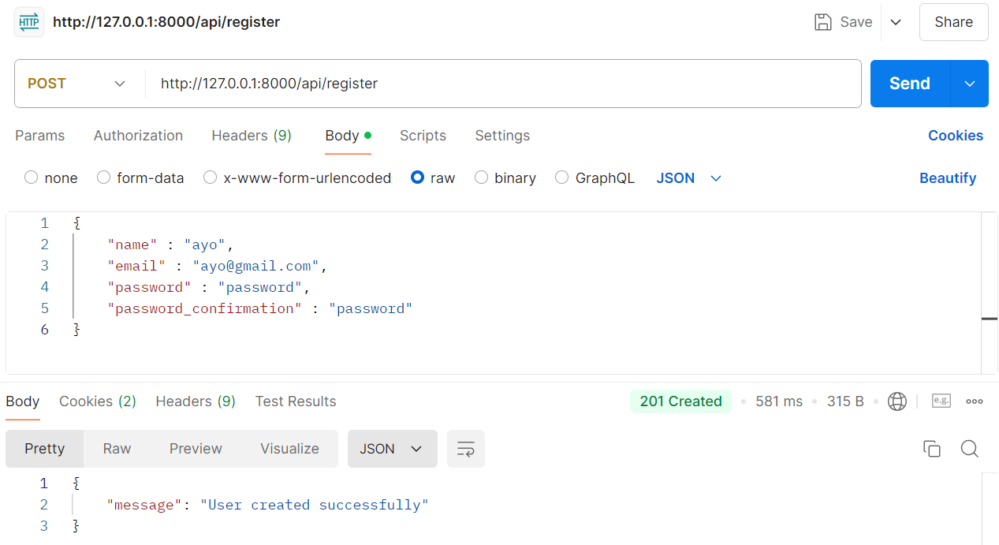
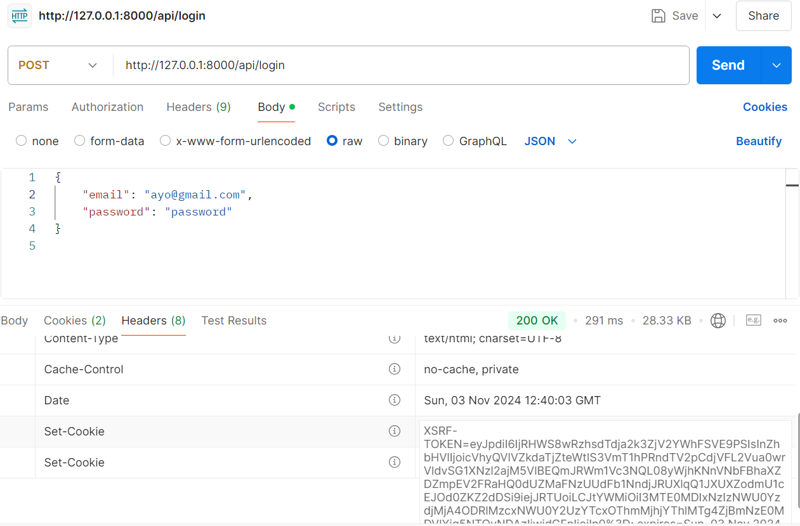
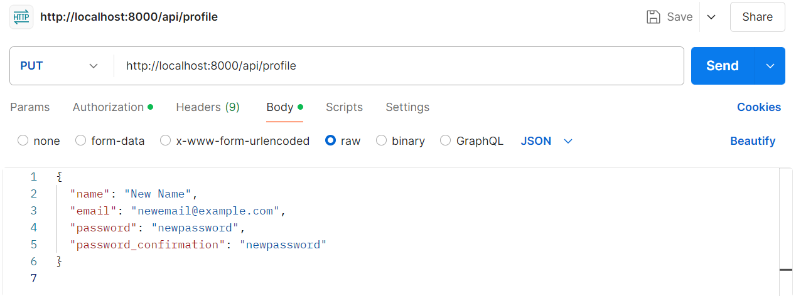
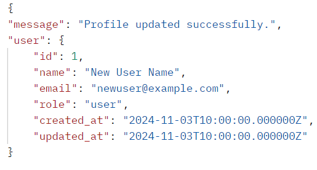
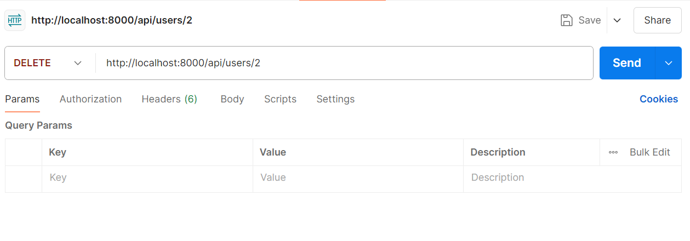
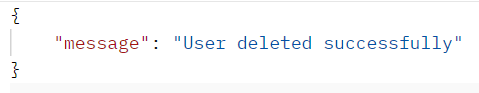
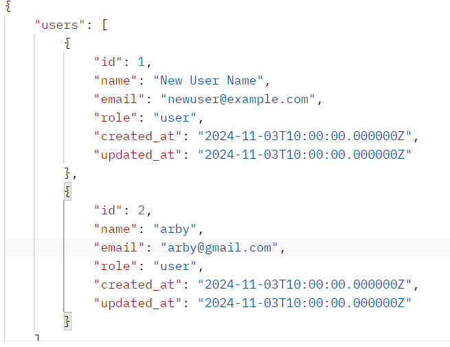

NAMA : MOH. ARBI ARDIANSYAH

NIM : 362358302150

KELAS : 2B TRPL

                                          Membangun API dengan Autentikasi
                                        dan Otorisasi menggunakan Laravel 10

1. Register pengguna

2. Login Pengguna

3. Update Pengguna

Hasil:

4.  Delete Pengguna

Hasil:

5. Mengambil Daftar Semua Pengguna

Hasil:

